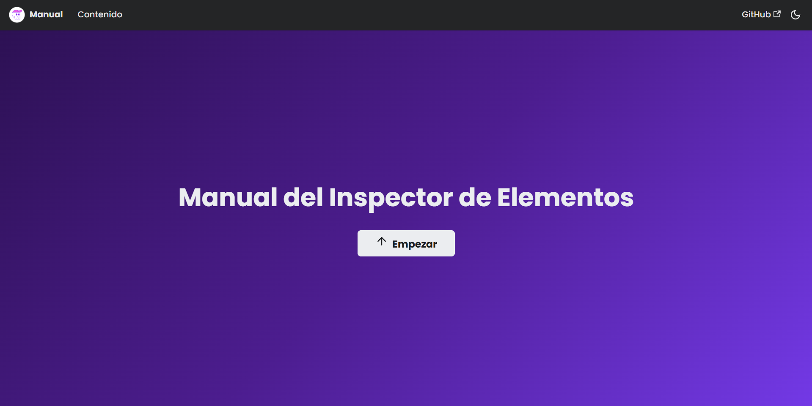

#  Manual del Inspector de Elementos 
## 📷 Vista del proyecto



## 🖊️ Descripción 

**Manual del Inspector de Elementos** es una documentación web interactiva desarrollada con [Docusaurus](https://docusaurus.io/). Su propósito es enseñar de forma clara y práctica cómo utilizar las herramientas de inspección de elementos en navegadores web. Es ideal para testers, desarrolladores, estudiantes y profesionales que buscan entender a fondo cómo están construidas las páginas web, identificar selectores CSS, inspeccionar estructuras HTML y analizar estilos aplicados. Con una interfaz intuitiva, navegación fluida y secciones bien organizadas, este proyecto se convierte en una guía moderna y accesible.

## 🌟 Características
-   📘 Documentación clara y estructurada por secciones
- ⚙️ Navegación lateral dinámica y sistema de búsqueda
- 🧠 Ejemplos prácticos con explicaciones detalladas
- 🖥️ Totalmente responsivo y compatible con móviles
- ✍️ Escrito en Markdown y MDX para facilitar la edición
- 💡 Enfocado en buenas prácticas para pruebas e inspección web

## 🔧 Tecnologías Utilizadas
- 🦖 [Docusaurus v2](https://docusaurus.io/)
-  ⚛️ **React.js**
-  📝 **Markdown / MDX**
- 🎨  **CSS personalizado**
- ✨ **JavaScript**

## 🖥️ Despliegue

El proyecto fue desplegado utilizando **cPanel**, una herramienta de administración web para gestionar el hosting y la publicación de sitios web. 


## 📦 Instalación
1. Clona el repositorio  
   ```bash
   https://github.com/deboraabarca/docusaurus.git
   
1. Accedes a la carpeta donde clonaste el repositorio

   ```bash
   cd docusaurus
   
1. Instala las dependencias 

    ```bash
   npm install

1. Instala el servidor para ver el proyecto

    ```bash
   npm run start

     
## 🚀 Deploy  
🔗 [https://941718947.facturalo.co/docusaurus/](https://941718947.facturalo.co/docusaurus/)

## 📝 Autor  
👤 **Debora**  
📧 Contacto: [abarcazavalad@gmail.com](mailto:tu-email@example.com)  
🐙 GitHub: [@deboraabarca](https://github.com/tu-usuario)  


  